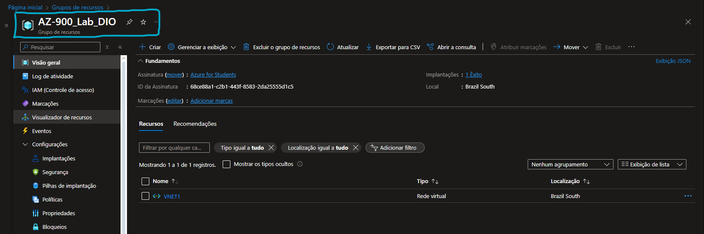

# Resumo do lab-dio

## Assunto: Construindo arquiteturas no Azure🖥️☑️
## Descrição:
Um dos primeiros passos para começar a criar recursos na **Microsoft Azure** ☁ é ter conhecimento do seguinte termo: **Grupo de recursos**.

Mas afinal, o que seria o **Grupo de recursos**? 
"é uma estrutura que permite organizar e gerenciar recursos relacionados dentro de um mesmo ambiente. Esses recursos podem incluir máquinas virtuais, contas de armazenamento, bancos de dados e serviços de rede, entre outros. O objetivo é facilitar a administração e o gerenciamento de políticas, controle de acesso, monitoramento e até a exclusão em massa desses recursos." 

Ao criar uma conta na **Microsoft Azure** ☁, você pode escolher que tipos de serviços quer utilizar e agrupar no tópico marcado na imagem abaixo: 

Após isso, você tem liberdade para configurar seu grupo de recurso. Onde, é possível definir nome do grupo, localidade de operação(_região do datacenter_), marcações extras e até mesmo explorar tópicos de automações. 

Dentro de um grupo de recursos criado, você pode colocar diversos serviços que quiser e acompanhar os seus registros de atividades, topologias, eventos(_automações de tarefas_), segurança e etc...

#### Em resumo, você pode criar um ambiente de trabalho dentro do _provider_:
1. Organizado e Visível;

2. Com Gerência Centralizada;

3. Fácil em Automação;

4. Com Monitoramento e Relatórios;

5. Consistente e Conforme;
