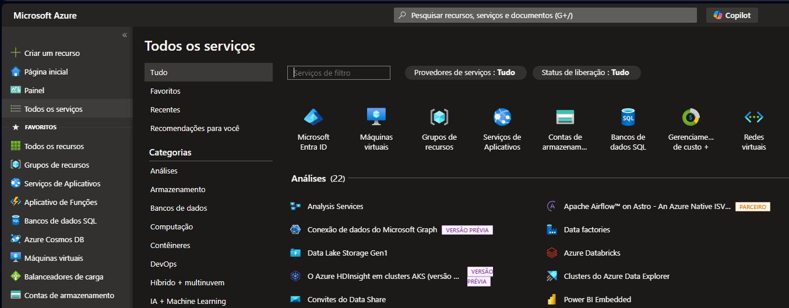
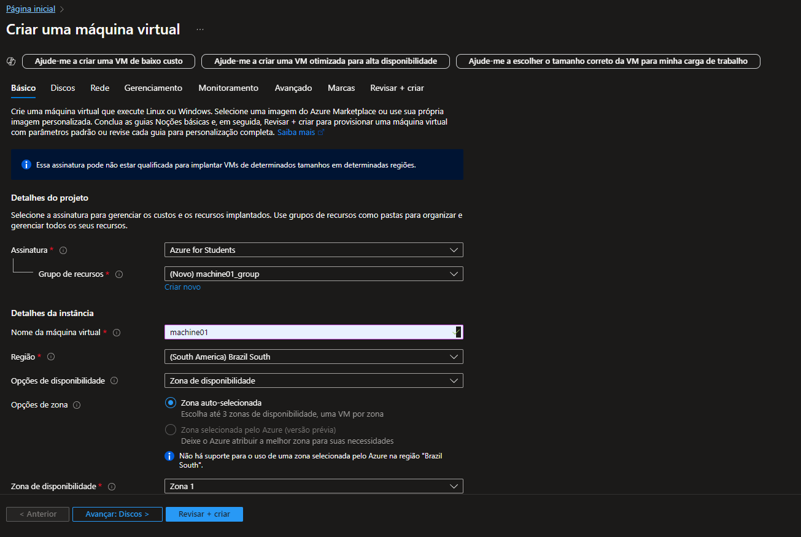

# Resumo do lab-dio

## Configurando Recursos e Dimensionamentos em Máquinas Virtuais na Azure 🖥️🌐🔵

## Descrição:
Neste desafio, foi possível compreender e aplicar os conceitos fundamentais para a configuração de recursos e o dimensionamento de máquinas virtuais (VMs) na Azure. 
  

Aprendemos que a escolha adequada do tamanho da VM, incluindo CPU, memória e armazenamento, **é essencial para garantir o desempenho e a otimização dos custos operacionais**. 
  

Além disso, a flexibilidade da Azure permite ajustar esses recursos conforme as demandas de carga de trabalho variam, o que é um diferencial importante para empresas que buscam escalabilidade.
Foi também destacado o papel de recursos adicionais, como discos gerenciados, balanceamento de carga e redes virtuais, que permitem melhorar a segurança e a eficiência das aplicações.
Com isso, o desafio proporcionou uma visão prática e estratégica sobre como dimensionar e configurar as VMs de forma eficiente dentro da plataforma Azure.